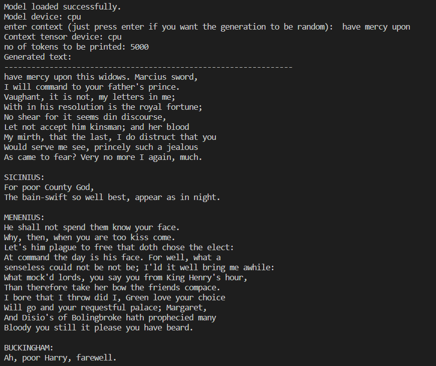
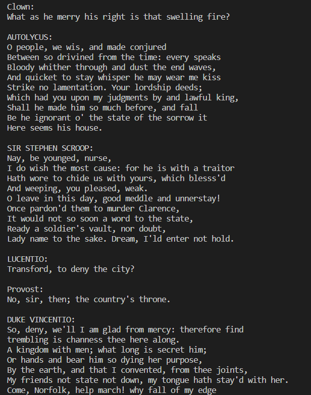

# Shakespearian Transformer

## Overview

Shakespearian Transformer is a project aimed at generating text in the style of Shakespeare using a transformer-based neural network model.
The style is replicated in the form of conversations between multiple people.

## Example Images
 

## Parameters
- **Dataset Size:** 1 million tokens
- **Parameters Learnt:** 10 million
- **context length:** 256

## Features

- **Data Loading:** Scripts for loading and preprocessing data.
- **Model Architecture:** Definition of the transformer model.
- **Training:** Scripts to train the model on the dataset.
- **Text Generation:** Generate Shakespearean style text using the trained model.

## Files

- `data_loader.py`: Loads and preprocesses text data.
- `encode_decode.py`: Handles encoding and decoding of text data.
- `generator.py`: Generates text using the trained model.
- `get_batch_data.py`: Prepares batch data for training.
- `loss_estimator.py`: Calculates loss during training.
- `model_architecture.py`: Defines the transformer model architecture.
- `train.py`: Script to train the model.
- `variables_loader.py`: Loads necessary variables and configurations.
- `input.txt`: Sample input text for training.
- `gpt.pth`: Pre-trained model weights.

## Usage

1. **Install Dependencies:** Ensure you have Python and necessary libraries installed.
2. **Prepare Data:** Use `data_loader.py` to preprocess your text data.
3. **Train Model:** Run `train.py` to train the model.
4. **Generate Text:** Use `generator.py` to generate text in Shakespearean style.

## Generation

The repository also include the weight file, the model was trained on 1 million tokens (character level tokenization), for approximately 5000 traninig cycles.
The generator.py can be used to directly initialize and generate characters by specifying context and token count.
Once generated, you can enjoy conversations between people in the style of shakesphere's likeness

## Contributing

Feel free to open issues or submit pull requests if you have suggestions for improvements.

